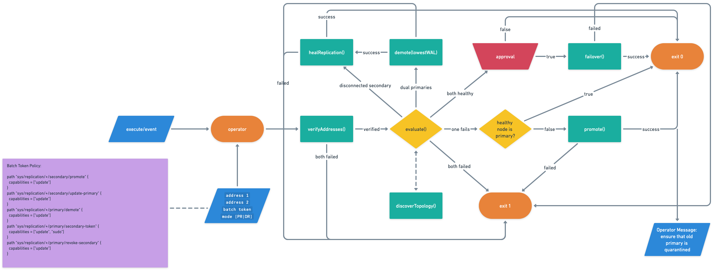

# vault-fm-operator

This is a helper utility to aid human or machine operators working with Vault in
various failure modes. Given two clusters that are in a replication
relationship, along with an appropriate batch token that has DR/PR operational
capabilities, this tool discovers the replication topology and state, and can
take action to recover, failover, or heal the configuration.

This project was written with the ultimate intention of supporting
fully-automated replication operations, such that a load balancer event might
be used to trigger it upon a cluster becoming unhealthy or returning to service.
However, this utility should be considered experimental, and anyone running
Vault in production should be cautious when implmenting autonomous operators.

**HashiCorp specifically advises against tooling of this nature. Use this code
at your own risk and thoroughly test in your environment before implementing
something like this in production.**

In many cases, it is a bad idea to automate DR/PR cluster promotion/demotion or
otherwise alter replication state in an automated way. Each environment is
different, and the "source of truth" or "vantage point that matters" differs for
each organization and environment.

```shell
Usage of vault-fm-operator:
  -addresses string
        Comma-separated list of two Vault addresses in a replication relationship (default "https://localhost:8200,https://localhost:8300")
  -mode string
        Replication mode to evaluate ('dr' or 'performance')
  -opBatchToken string
        Operation batch token with a policy that allows for the manipulation of replication configurations on either cluster
  -tlsSkipVerify
        Skip TLS verification of the Vault server's certificate
```

## Flow


## Requirements

### Token Policy
A batch token with the following capabilities is required for the tool to
operate as intended:
```hcl
path "sys/replication/+/secondary/promote" {
  capabilities = ["update"]
}

path "sys/replication/+/secondary/update-primary" {
  capabilities = ["update"]
}

path "sys/replication/+/primary/demote" {
  capabilities = ["update"]
}

path "sys/replication/+/primary/secondary-token" {
  capabilities = ["update", "sudo"]
}

path "sys/replication/+/primary/revoke-secondary" {
  capabilities = ["update"]
}

path "auth/token/lookup-self" {
	capabilities = ["read"]
}
```

**Note**: if a token is not included in the arguments at runtime, the operator
will be prompted to create an appropriate "DR operations" batch token. If the
operator confirms this intent, the utility will:
- further prompt for a token to use when making the required calls to Vault
- ensure that the above policy exists in Vault in the root namespace (creating
it if needed)
- create a token with this policy attached
- store the resulting token in Vault's KV engine at the path defined by the
contstants `kvEnginePath`/`tokenKvPath` defined in `main.go`.
- exit

This feature may serve to simplify Vault DR/PR operations token lifecycle
management.

## Behavior
This utility will take action **without prompting** in the following scenarios:
- dual primary clusters: cluster with the lower WAL will be demoted
- disconnected secondary: secondary will be healed/updated
- secondary healthy, no primary available: secondary will be promoted

Scenarios that will trigger a prompt and wait for operator response:
- both clusters healthy: prompt for a failover (role-reversal)
- no operation token provided: prompt to create one and store in Vault's KV
engine
